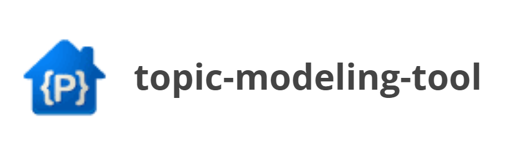
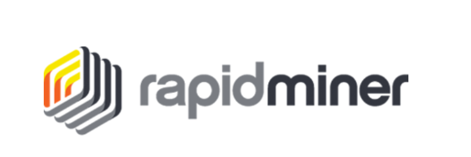

## Hands-on-Training

### The `github repository` contains a reproducible research compendium for the case study used in the book.

### So you can reproduce the analysis in the cloud without having to install any software or downloading the data. The computational environment runs using BinderHub. Click the `Virtual RSTUDIO SERVER` to open an interactive virtual RStudio environment or `VIRTUAL JUPYTER NOTEBOOK` to open an interactive virtual Jupyter notebook for a hands-on practice for the case studies that used R programming language. In the virtual environment, open the `stm.R` file to perform topic modeling.

#### Things to Remember while Using the Virtual Environment (Binder):
#### 1. The server has limited memory so you cannot load large datasets or run big computations.
#### 2. Binder is meant for interactive and ephemeral interactive coding so an instance will die after 10 minutes of inactivity.
#### 3. An instance cannot be kept alive for more than 12 hours.

### Alternatively, you can click on `DATA` to download all the files related to the case study as a zip archive. After unpacking the downloaded zip archive, you can explore the files on your computer.

---

## Contents

### The compendium contains the data, code, and notebook associated with the case study. This case study is further divided into `Case Study 4A: Topic Modeling of Documents using Topic-Modeling-Tool `, `Case Study 4B: Topic Modeling of Documents using RapidMiner`, and `Case Study 4C: Topic Modeling of Documents using R`. 4A case study used Topic-Modeling-Tool, 4B case study used RapidMiner platform, and 4C case study used R programming language to perform topic modeling. It is organized as follows:

#### * `4a_dataset\` folder contains the data for 4A case study;
#### * `4a_supplementary.docx` file contains the supplementary data associated with 4A case study;
#### * `4b_dataset\` folder contains the data for 4B case study;
#### * `4b_supplementary.pdf` file contains the supplemtary data associated with 4B case study;
#### * `4c_dataset.csv` file contains the data for 4C case study;
#### * `stm.R` file contatins the R code for 4C case study; and
#### * `Case_Study_4C.ipynb` file contatins the Jupyter notebook for 4C case study.
---
## Platform/Software/Tool/Packages Used

### [Download Topic-Modeling-Tool](https://code.google.com/archive/p/topic-modeling-tool/)

### [Download RapidMiner](https://my.rapidminer.com/nexus/account/index.html#downloads)

### [Download R](https://cran.r-project.org/bin/windows/base/)
### [Download RStudio](https://rstudio.com/)

---

# Licenses

### Code, Data : CC-BY-4.0

---
